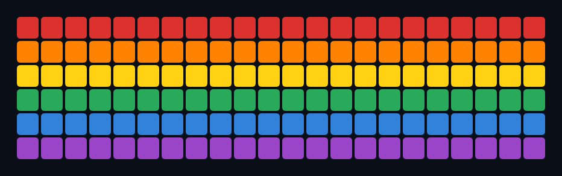

# Pride Plugin 🏳️‍🌈

Pride flags, rainbow color patterns, hearts, and LGBTQ+ history for your FiestaBoard split-flap display.



**→ [Setup Guide](./docs/SETUP.md)** — Modes, selection, and pool filters

## Overview

The Pride plugin renders 21 distinct art pieces on the 8-tile board palette: 12 stripe flags, 3 vertical-stripe variants, 4 patterns (diagonal, checker, arc, alive sparkle), a rainbow heart, and an equality symbol. Pieces can be picked explicitly, rotated on a timer, picked deterministically per calendar day, or drawn randomly. An optional category pool restricts the candidates to flags, patterns, hearts, or symbols. Pure local rendering — no network, no API keys.

Both the flagship (6×22) and note (3×15) displays are supported automatically — every fetch publishes both sizes as separate template variables and each demo's template picks the right one. No device setting needed.

## Art Pieces

### Flags (12)
Rainbow, Trans, Bi, Pan, Lesbian, Ace, Non-binary, Progress, Intersex, Leather, Polyamory, Genderfluid.

### Patterns (7)
- **Rainbow Columns / Trans Columns / Bi Columns** — vertical-stripe variants
- **Rainbow Diagonal** — diagonal rainbow sweep
- **Rainbow Checker** — 2×2 colored blocks cycling through the spectrum
- **Rainbow Arc** — centered pyramid bands, red on top
- **Rainbow Sparkle** — slowly-evolving sparkle field; one tile changes every 30 seconds, so it feels alive without being loud. The state is derived from wall-clock time, so two boards in the same room stay in sync.

### Hearts (1)
- **Rainbow Heart** — hand-pixeled six-row heart, red apex fading to violet point

### Symbols (1)
- **Equality** — two yellow bars on a blue field, HRC-style

## Selection Modes

| Mode | Behavior |
|------|----------|
| `pick` | Render the explicit `piece` setting |
| `rotate` | Cycle through the pool on `rotate_seconds` (default 10 minutes) |
| `daily` | One piece per calendar day, deterministic across reboots |
| `random` | Re-roll each fetch |

The `pool` setting (a list of categories: `flag`, `pattern`, `heart`, `symbol`) restricts the candidates for rotate/daily/random. Empty pool = all 21 pieces.

## Color Approximations

The Vestaboard's 8-tile palette has no pink, brown, or cyan, so several flags lean on the nearest substitute:

| Real color | Tile used |
|-----------|-----------|
| Pink      | `{red}`   |
| Magenta   | `{violet}`|
| Gray      | `{white}` |
| Cyan      | `{blue}`  |
| Brown     | (omitted) |

## Template Variables

```
{{pride.art}}            # Active piece, rendered for the flagship (6x22) display
{{pride.art_note}}       # Same piece, rendered for the note (3x15) display
{{pride.piece_id}}       # e.g. "rainbow", "rainbow_heart", "equality"
{{pride.piece_name}}     # e.g. "Rainbow", "Rainbow Heart", "Equality"
{{pride.piece_category}} # "flag", "pattern", "heart", "symbol", "history"
{{pride.tagline}}        # e.g. "Love is love", "Alive and slow"
{{pride.mode}}           # "art" or "history"
{{pride.history_year}}   # Year of today's history entry (history mode)
{{pride.history_text}}   # Text of today's history entry (history mode)
```

## Configuration

| Setting | Default | Description |
|---------|---------|-------------|
| `enabled` | `false` | Master switch |
| `mode` | `art` | `art` or `history` |
| `selection` | `rotate` | `pick`, `rotate`, `daily`, `random` |
| `piece` | `rainbow` | Used when `selection = pick` |
| `pool` | `[]` | Categories for rotate/daily/random (empty = all) |
| `rotate_seconds` | `600` | Rotation interval |
| `message` | `""` | Optional centered overlay (≤ 22 chars) |
| `refresh_seconds` | `300` | How often to recompute. Set to `30` to let the alive Rainbow Sparkle evolve smoothly. |

Environment variable equivalents (prefix `PRIDE_*`) are listed in `manifest.json`.

## Testing

```bash
python -m pytest tests/ -v
```

Tests cover every piece at both display sizes, all four selection modes, pool filtering, message overlay, the alive-sparkle mutation behavior, and history lookup. No network.

## Roadmap

- v0.3 — Progress chevron, Intersex ring, Leather heart, Poly infinity overlays; Pride Month countdown; awareness-day auto-flag matching
- v0.4 — Pride parade countdown by city; LGBTQ+ icon quote-of-the-day; rainbow gradient text helper; webhook "celebrate" trigger

## License

MIT — see [LICENSE](./LICENSE).
